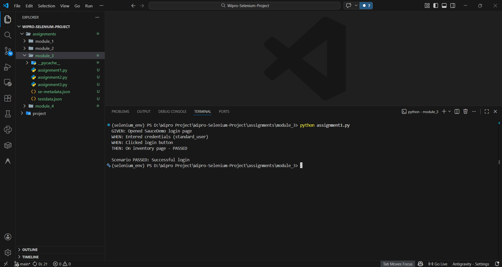
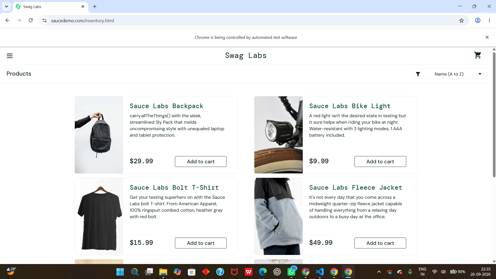
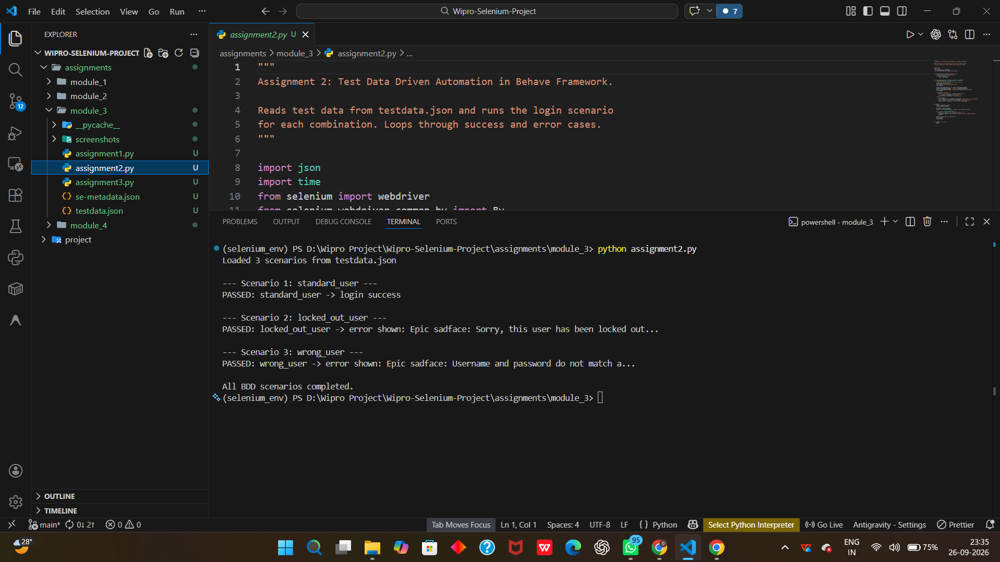
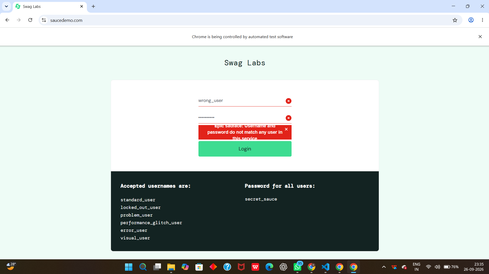
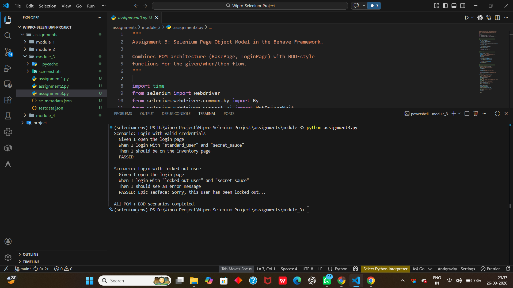
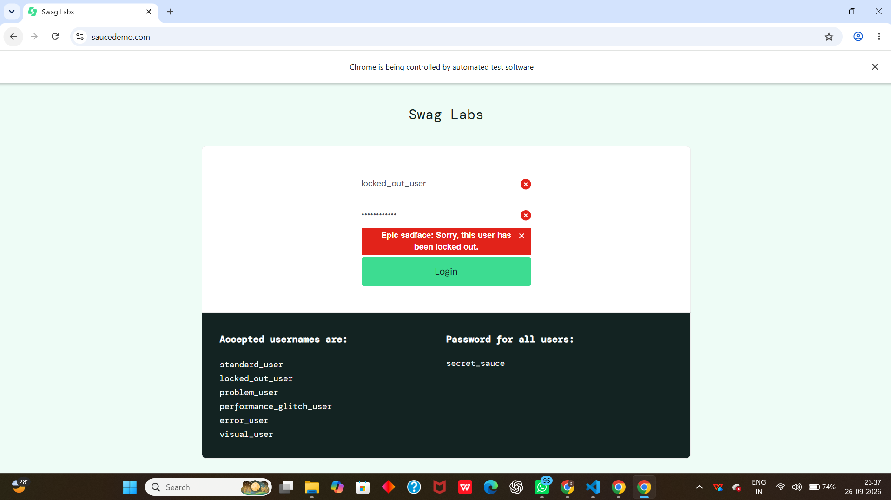

# Module 3: Behavior-Driven Development with Selenium

Covers Selenium-based BDD-style scenarios, data-driven testing, and Page Object Model design.

## Assignments

| Assignment | Name | Code |
| --- | --- | --- |
| 1 | Selenium Python + Behave BDD Setup | [assignment1.py](assignment1.py) |
| 2 | Test Data Driven Automation in Behave Framework | [assignment2.py](assignment2.py) |
| 3 | Selenium Page Object Model in the Behave Framework | [assignment3.py](assignment3.py) |

## Output Screenshots

### Assignment 1 — Selenium Python + Behave BDD Setup

**Terminal Output:**

**Browser Output:**

### Assignment 2 — Test Data Driven Automation in Behave Framework

**Terminal Output:**

**Browser Output:**

### Assignment 3 — Selenium Page Object Model in the Behave Framework

**Terminal Output:**

**Browser Output:**

