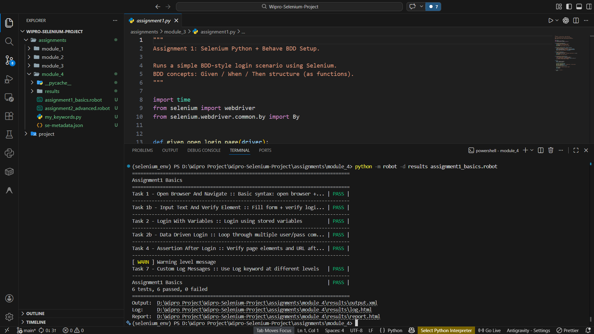
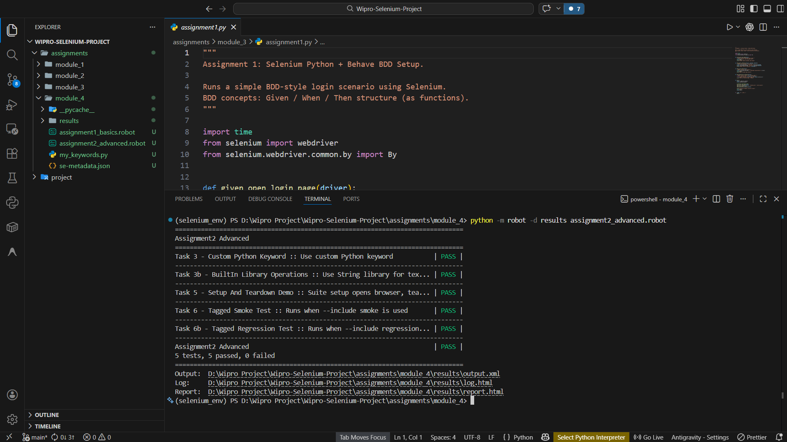

# Module 4: Robot Framework with SeleniumLibrary

Covers Robot Framework syntax, SeleniumLibrary browser automation, custom Python keywords, variables, data-driven flows, assertions, setup and teardown, and tags.

## Assignments

| Assignment | Name | Code |
| --- | --- | --- |
| 1 | Robot Framework Selenium Basics | [assignment1_basics.robot](assignment1_basics.robot) |
| 2 | Robot Framework Advanced Automation and Custom Python Keywords | [assignment2_advanced.robot](assignment2_advanced.robot) |

## Supporting Code

- [my_keywords.py](my_keywords.py) — provides the `Add Numbers` custom Robot Framework keyword.

## Output Screenshots

### Assignment 1 — Robot Framework Selenium Basics

**Test Output:**

### Assignment 2 — Robot Framework Advanced Automation and Custom Python Keywords

**Test Output:**

